# Models-Task-Main 
A ideia desse arquivo é transformar o entendimento de um código rebuscado e de alta complexidade em minimamente entendível a uma linguagem acessivel a todos. Ao elaborar esse documento dividi criteriosamente o entendimento por tópicos com prioridades de cima para baixo

> ## pressione CTRL + SHIFT + V para visualizar o .md na Preview


## Sumário
- [**Arquitetura de Pastas**](#arquitetura-de-pastas)
- [**Diagrama de Entidades**](#diagrama-de-entidades)
- [**Dicionario de Termos Técnicos**](#dicionario-de-termos-técnicos)
- [**Workspace.py**](#workspacepy)


<a id=""></a>

## <a id="Arquitetura de Pastas"></a>Arquitetura de Pastas
```
📦 [models](#models)
 ┣ 📂 integration                   # Lógica de conexão com serviços terceiros
 ┃ ┣ 📜 __init__.py
 ┃ ┣ 📜 base.py                     # Classe base para integrações
 ┃ ┣ 📜 github.py                   # Integração específica com o GitHub
 ┃ ┗ 📜 slack.py                    # Integração específica com o Slack
 ┣ 📜 READMeEstruturaModels.md
 ┣ 📜 __init__.py
 ┣ 📜 analytic.py                   # Métricas de dados e análise do sistema
 ┣ 📜 api.py                        # Estrutura de dados voltada para a API
 ┣ 📜 asset.py                      # Gerenciamento de arquivos e uploads
 ┣ 📜 base.py                       # Classe abstrata para outros modelos (Estrutura de Dados/ORM)
 ┣ 📜 cycle.py                      # Gerenciamento de ciclos (Sprints)
 ┣ 📜 deploy_board.py               # Estrutura para placas de status de deploy
 ┣ 📜 description.py                # Lógica de conteúdo rico (formatado) de cada tarefa
 ┣ 📜 device.py                     # Informações sobre o dispositivo de cada usuário
 ┣ 📜 draft.py                      # Gerenciamento de rascunhos salvos
 ┣ 📜 estimate.py                   # Estimativa de esforço
 ┣ 📜 exporter.py                   # Lógica de exportação de dados
 ┣ 📜 favorite.py                   # Sistema de itens favoritos do usuário
 ┣ 📜 importer.py                   # Lógica de importação de dados de outras plataformas
 ┣ 📜 intake.py                     # Funcionalidade de entrada de demandas (formulários)
 ┣ 📜 issue.py                      # Modelo central de tarefas/tickets
 ┣ 📜 issue_type.py                 # Definição de tipos de tarefa (Bug, Feature, etc)
 ┣ 📜 label.py                      # Sistema de etiquetas (tags)
 ┣ 📜 module.py                     # Agrupadores de tarefas (Módulos/Epics)
 ┣ 📜 notification.py               # Sistema de notificações internas
 ┣ 📜 page.py                       # Páginas de documentação (Wiki)
 ┣ 📜 project.py                    # Estrutura de projetos
 ┣ 📜 recent_visit.py               # Histórico de navegações recentes
 ┣ 📜 session.py                    # Gestão de sessões do usuário
 ┣ 📜 social_connection.py          # Conexões via redes sociais (OAuth)
 ┣ 📜 state.py                      # Workflow (Estados das tarefas)
 ┣ 📜 sticky.py                     # Notas adesivas virtuais
 ┣ 📜 user.py                       # Modelo de usuário
 ┣ 📜 view.py                       # Configurações de visualização e filtros
 ┣ 📜 webhook.py                    # Configuração de eventos externos (Webhooks)
 ┗ 📜 workspace.py                  # Estrutura principal de Espaços de Trabalho


```

## <a id="Diagrama de Entidades"></a>Diagrama de Entidades
A proposta desse diagrama é o entendimento de Hierarquias das classes do models,
para a visualização do mesmo pelo VScode basta:
- Baixar a extensão: Markdown Preview Mermaid Support

```mermaid
erDiagram
    User {
        UUID id PK
        string username
        string email
        string display_name
        string first_name
        string last_name
        boolean is_active
        boolean is_bot
        datetime created_at
        datetime updated_at
    }

    Profile {
        UUID id PK
        UUID user_id FK
        string role
        string language
        boolean is_onboarded
        json theme
    }

    Account {
        UUID id PK
        UUID user_id FK
        string provider
        string provider_account_id
        string access_token
        datetime last_connected_at
    }

    Workspace {
        UUID id PK
        UUID owner_id FK
        UUID created_by_id FK
        string name
        string slug
        string timezone
        datetime created_at
        datetime updated_at
        datetime deleted_at
    }

    WorkspaceMember {
        UUID id PK
        UUID workspace_id FK
        UUID member_id FK
        UUID created_by_id FK
        int role
        boolean is_active
    }

    Project {
        UUID id PK
        UUID workspace_id FK
        UUID created_by_id FK
        string name
        string identifier
        int network
        boolean is_archived
        datetime created_at
        datetime deleted_at
    }

    ProjectMember {
        UUID id PK
        UUID project_id FK
        UUID workspace_id FK
        UUID member_id FK
        int role
        boolean is_active
    }

    State {
        UUID id PK
        UUID project_id FK
        UUID workspace_id FK
        string name
        string color
        string group
        boolean is_default
    }

    Label {
        UUID id PK
        UUID project_id FK
        UUID workspace_id FK
        UUID parent_id FK
        string name
        string color
    }

    IssueType {
        UUID id PK
        UUID workspace_id FK
        string name
        boolean is_epic
        boolean is_default
        boolean is_active
    }

    Issue {
        UUID id PK
        UUID project_id FK
        UUID workspace_id FK
        UUID parent_id FK
        UUID state_id FK
        UUID estimate_point_id FK
        UUID type_id FK
        UUID created_by_id FK
        string name
        string priority
        boolean is_draft
        date start_date
        date target_date
        datetime completed_at
        datetime deleted_at
    }

    IssueAssignee {
        UUID id PK
        UUID issue_id FK
        UUID assignee_id FK
        UUID project_id FK
    }

    IssueLabel {
        UUID id PK
        UUID issue_id FK
        UUID label_id FK
        UUID project_id FK
    }

    IssueComment {
        UUID id PK
        UUID issue_id FK
        UUID actor_id FK
        UUID project_id FK
        text comment_html
        string access
        datetime created_at
    }

    IssueActivity {
        UUID id PK
        UUID issue_id FK
        UUID actor_id FK
        UUID issue_comment_id FK
        UUID project_id FK
        string verb
        string field
        string old_value
        string new_value
    }

    IssueReaction {
        UUID id PK
        UUID issue_id FK
        UUID actor_id FK
        UUID project_id FK
        string reaction
    }

    IssueRelation {
        UUID id PK
        UUID issue_id FK
        UUID related_issue_id FK
        UUID project_id FK
        string relation_type
    }

    IssueSubscriber {
        UUID id PK
        UUID issue_id FK
        UUID subscriber_id FK
        UUID project_id FK
    }

    Cycle {
        UUID id PK
        UUID project_id FK
        UUID workspace_id FK
        UUID owned_by_id FK
        string name
        datetime start_date
        datetime end_date
        datetime archived_at
    }

    CycleIssue {
        UUID id PK
        UUID cycle_id FK
        UUID issue_id FK
        UUID project_id FK
    }

    Module {
        UUID id PK
        UUID project_id FK
        UUID workspace_id FK
        UUID lead_id FK
        string name
        string status
        date start_date
        date target_date
    }

    ModuleIssue {
        UUID id PK
        UUID module_id FK
        UUID issue_id FK
        UUID project_id FK
    }

    Intake {
        UUID id PK
        UUID project_id FK
        UUID workspace_id FK
        string name
        boolean is_default
    }

    IntakeIssue {
        UUID id PK
        UUID intake_id FK
        UUID issue_id FK
        UUID duplicate_to_id FK
        UUID project_id FK
        int status
        datetime snoozed_till
    }

    Page {
        UUID id PK
        UUID project_id FK
        UUID workspace_id FK
        UUID owned_by_id FK
        UUID parent_id FK
        string name
        int access
        boolean is_locked
        datetime archived_at
    }

    FileAsset {
        UUID id PK
        UUID user_id FK
        UUID workspace_id FK
        UUID project_id FK
        UUID issue_id FK
        UUID comment_id FK
        UUID page_id FK
        string entity_type
        float size
        boolean is_uploaded
        boolean is_deleted
    }

    APIToken {
        UUID id PK
        UUID user_id FK
        UUID workspace_id FK
        UUID created_by_id FK
        string label
        string token
        boolean is_active
        int user_type
        datetime expired_at
    }

    Webhook {
        UUID id PK
        UUID workspace_id FK
        string url
        boolean is_active
        boolean issue
        boolean cycle
        boolean module
    }

    Notification {
        UUID id PK
        UUID workspace_id FK
        UUID project_id FK
        UUID receiver_id FK
        UUID triggered_by_id FK
        text title
        string entity_name
        datetime read_at
    }

    User ||--|| Profile : "tem"
    User ||--o{ Account : "possui"
    User ||--o{ WorkspaceMember : "participa"
    User ||--o{ ProjectMember : "participa"

    Workspace ||--o{ WorkspaceMember : "contém"
    Workspace ||--o{ Project : "contém"
    Workspace ||--o{ APIToken : "possui"
    Workspace ||--o{ Webhook : "possui"
    Workspace ||--o{ Notification : "gera"

    Project ||--o{ State : "define"
    Project ||--o{ Label : "define"
    Project ||--o{ Issue : "contém"
    Project ||--o{ Cycle : "possui"
    Project ||--o{ Module : "possui"
    Project ||--o{ Intake : "possui"
    Project ||--o{ Page : "possui"
    Project ||--o{ ProjectMember : "tem"

    Issue ||--o{ IssueComment : "recebe"
    Issue ||--o{ IssueActivity : "registra"
    Issue ||--o{ IssueAssignee : "atribuído a"
    Issue ||--o{ IssueLabel : "marcado com"
    Issue ||--o{ IssueReaction : "reações"
    Issue ||--o{ IssueSubscriber : "inscritos"
    Issue ||--o{ IssueRelation : "relacionado"
    Issue ||--o{ CycleIssue : "pertence a"
    Issue ||--o{ ModuleIssue : "pertence a"
    Issue ||--o{ IntakeIssue : "triagem"
    Issue ||--o{ FileAsset : "tem arquivos"
    Issue }o--o| Issue : "sub-issue (parent)"

    IssueAssignee }o--|| User : "assignee"
    IssueSubscriber }o--|| User : "subscriber"
    IssueReaction }o--|| User : "actor"
    IssueActivity }o--|| User : "actor"
    IssueComment }o--|| User : "autor"

    Cycle ||--o{ CycleIssue : "contém"
    Module ||--o{ ModuleIssue : "contém"
    Intake ||--o{ IntakeIssue : "recebe"

    State }o--|| Project : "pertence a"
    Label }o--o| Label : "sub-label (parent)"

    Issue }o--o| State : "tem estado"
    Issue }o--o| IssueType : "tem tipo"
    IssueType }o--|| Workspace : "pertence a"

    Page }o--o| Page : "sub-page (parent)"
    Page ||--o{ FileAsset : "tem arquivos"

```



## <a id="Dicionario de Termos Técnicos"></a>Dicionario de Termos Técnicos
Adicione aqui termos que nao sao bem compreendidos para facilitar a leitura

- <a id="UI"></a>`UI`: Interface do usuário
- <a id="Slug"></a>`Slug` : Parte da url ou identificador unico que facilita a leitura a nivel humano
- <a id="Accordion"></a>`Accordion (Sanfona)`: Padrão de interface que organiza conteúdo em seções verticais expansíveis
- <a id="Tabbed"></a>`Tabbed (Abas)`: Padrão de interface que organiza conteúdos em guias (abas) horizontais


# Funcionalidade de Cada Arquivo

> ## <a id="Workspace.py "></a>Workspace.py 


O Workspace é o Coração do sistema. Este módulo armazena as configurações globais de uma empresa ou equipe, atuando como o núcleo de permissões e hierarquias.

### Responsabilidades principais

* **Identificação**: Nome, Logo e Slug única.
* **Localização**: Definição de fuso horário e atribuição do dono (*owner*) do espaço.
* **Regras de Exclusão (Soft Delete)**: O sistema não remove o registro do banco de dados ao ser deletado; ele apenas renomeia a [`slug`](#Slug) para evitar conflitos, permitindo que o nome do workspace possa ser reutilizado no futuro.


## Gestão de Pessoas

### Workspace Members
Define o relacionamento entre o **workspace** e o **usuário**.
* **Permissões:** Controla o nível de acesso (Admin, Editor, Viewer).
* **Interface:** Armazena preferências e configurações visuais do usuário dentro do ambiente.

### Workspace Member Invite
Gerencia o fluxo de convites via e-mail.
* **Token:** Armazena a chave única para validação do convite.
* **Status:** Monitora o ciclo de vida do convite (Pendente, Aceito ou Recusado).


## Organização Interna - Team
- Permite criar subgrupos dentro de um workspace. è util para separar departamentos ou células de trabalho

## Organizaçãoe UX
Esse arquivo tem muitos modelos focados em **Estado da [`UI`](#UI)**, o sistema quer que quando voce volte ele mantenha a organização xatamente da forma que voçê o deixou. Por isso existem varios modelos com JSONField(Para salvar configurações flexiveis)

- **WorkspaceUserProperties**: Salva como o usuários gostam de ver seus dados(filtros, propriedades exibidas, estilo de navegaçâo como [`Accordion`](#Accordion) ou Tabbed).

